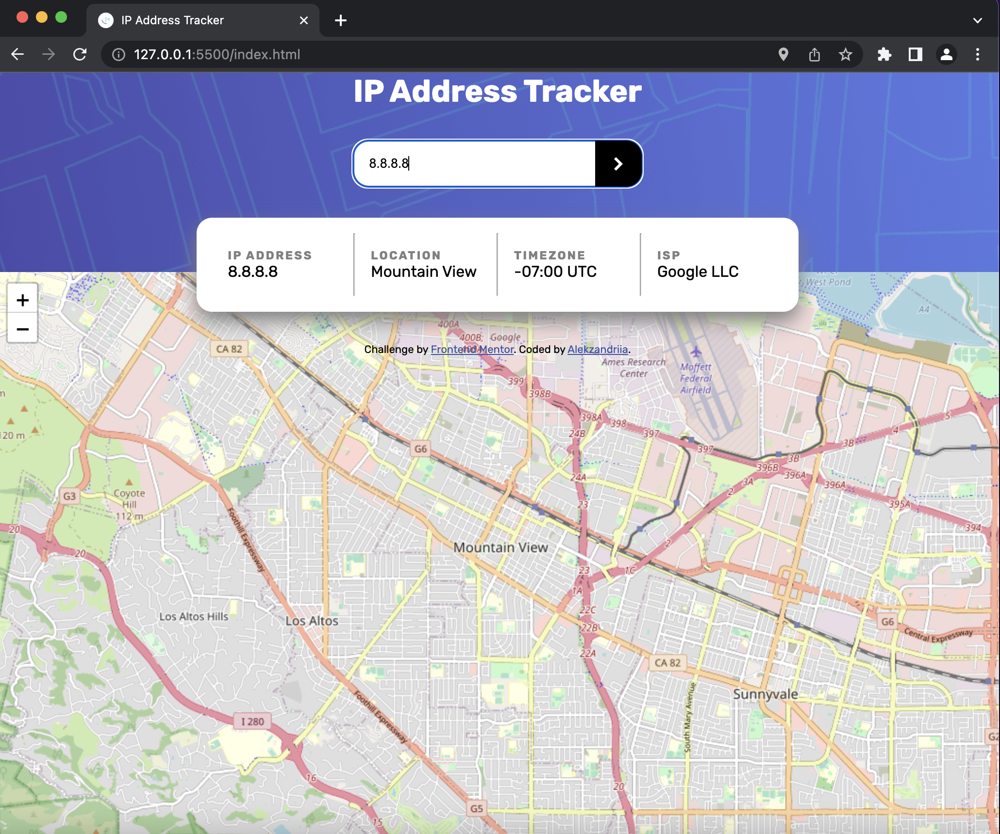

# ip-address-tracker

This is a solution to the [IP address tracker challenge on Frontend Mentor](https://www.frontendmentor.io/challenges/ip-address-tracker-I8-0yYAH0). Frontend Mentor challenges help you improve your coding skills by building realistic projects.

## Table of contents

- [Overview](#overview)
  - [The challenge](#the-challenge)
  - [Screenshot](#screenshot)
  - [Links](#links)
- [My process](#my-process)
  - [Built with](#built-with)
  - [What I learned](#what-i-learned)
  - [Continued development](#continued-development)
  - [Useful resources](#useful-resources)
- [Author](#author)

## Overview

### The challenge

Users should be able to:

- View the optimal layout for each page depending on their device's screen size
- See hover states for all interactive elements on the page
- See their own IP address on the map on the initial page load
- Search for any IP addresses or domains and see the key information and location

### Screenshot

### Links

- Live Site URL: [Live Demo](https://alekzandriia.github.io/ip-address-tracker)
- Solution URL: [Source Code](https://github.com/alekzandriia/ip-address-tracker)

## My process

### Built with

- Semantic HTML5 markup
- CSS
- Flexbox
- JavaScript
- LeafletJS API
- IPify API

### What I learned

How to use user inputs for search query
I tried using string concatenation for the search param but that didn't work so I went down a unproductive rabbit hole until I finally realized you just need to use backticks/ string interpolation... 🤦‍♀️

Once I realized that I quickly figured out that I also needed to scope the userQuery variable to the function so that it updates with the event listener and not beforehand.

### Continued development

I didn't hide my API key because I ran out of time... 😅 but in the future I'd hide the key using either Netlify functions or dotenv files and NodeJS. I'm not worried about this at the moment because it's a free API (with limited requests).

### Useful resources

Thanks to [Scott O'Hara](https://www.scottohara.me/blog/2014/06/24/pseudo-element-input.html) for teaching me that you can't add pseudo elements to input elements, you can only add them to container elements.

Getting the map going was pretty easy & getting it to update the coordinates was simple as well because the [leaflet docs](https://leafletjs.com/examples/quick-start/) are great & easy to understand.

## Author

- Website - [Alekzandriia](https://www.alekz.dev)
- Frontend Mentor - [@alekzandriia](https://www.frontendmentor.io/profile/alekzandria)
- Twitter - [@alekzandriia](https://www.twitter.com/alekzandriia)
